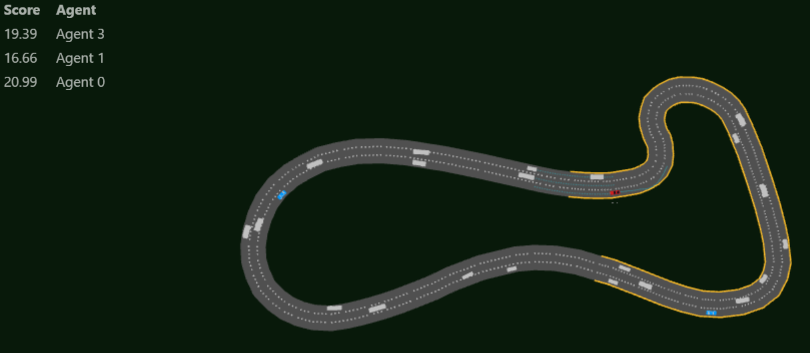

# Robust-Simulation-for-DRL-Autonomous-Vehicle
[](https://github.com/huawei-noah/SMARTS/actions/workflows/ci-base-tests-linux.yml?query=branch%3Amaster) 
[](https://github.com/huawei-noah/SMARTS/actions/workflows/ci-format.yml?query=branch%3Amaster)
[](https://smarts.readthedocs.io/en/latest/?badge=latest)
 
[](https://badge.fury.io/py/smarts)
[](https://badge.fury.io/py/smarts)
[](https://opensource.org/licenses/MIT)

Welcome to the **Robust Simulation for DRL Autonomous Vehicle** project! This initiative is centered on comprehensive research on [**SMARTS**](https://arxiv.org/abs/2010.09776) (Scalable Multi-Agent Reinforcement Learning Training School for Autonomous Driving), a sophisticated platform designed for scalable navigation solutions. SMARTS supports a variable number of vehicles and complex navigation scenarios, enabling the application of deep reinforcement learning (DRL) algorithms to enhance driving in multi-agent systems. We encourage you to follow the provided instructions below to experiment and explore the advanced capabilities of the SMARTS simulator.


## :writing_hand: Authors
[Tal Amar](https://github.com/Tal-Amar), [Itay Saig](https://github.com/Itay-Saig), [Ido Pascaro](https://github.com/idopasc)

## :clipboard: Table of Contents
  * [Instructions](#bookmark_tabs-Instructions)
  * [Acknowledgements](#speech_balloon-Acknowledgements)


## :bookmark_tabs: Instructions
This guide will walk you through the essential stages of setting up and working with SMARTS. Follow the instructions below to get started.

### Stage 1: Install SMARTS

**Prerequisites:** Ensure you have **`python3 (3.8, 3.9, 3.10, 3.11)`** and **`ubuntu (>=16.04)`** installed on your system. If you don’t have Ubuntu, install Windows Subsystem for Linux (WSL).

The setup of SMARTS, including a demo video for installation, can be found [**here**](https://smarts.readthedocs.io/en/latest/setup.html).

---

### Stage 2: Setting Up SMARTS with PyCharm

To ensure you have the latest version of SMARTS, please update your existing installation using the following commands in Windows Subsystem for Linux (WSL):

```bash
cd SMARTS
git pull
pip install -e '.[camera-obs,sumo,examples]'
```

- #### Navigate to the SMARTS Directory:

  1. On your local computer, go to the path: `\\wsl.localhost\Ubuntu\home\*your_user_name*`.
  2. Right-click on the SMARTS folder and select "Open Folder as PyCharm Project".

- #### Configure the Python Interpreter:

  1. In PyCharm, change the interpreter by clicking on: "Add Interpreter…" → "WSL" → "Python interpreter path:".
  2. Enter the following path: `\\wsl$\Ubuntu\home\*your_user_name*\SMARTS\.venv\bin\python`.

- #### Open PyCharm Terminal and Switch to Ubuntu:
  
  Open the terminal in PyCharm and switch it to use Ubuntu.
  
- #### Follow the Setup Commands:

  Execute the following commands (skip the first command if the virtual environment already exists), and refer to the [setup guide](https://smarts.readthedocs.io/en/latest/setup.html#development) provided in the official SMARTS documentation:

  ```bash
  # For Mac OS X users, ensure XQuartz is pre-installed.
  # Install the system requirements. You may use the `-y` option to enable automatic
  # assumption of "yes" to all prompts to avoid timeout from waiting for user input
  $ bash utils/setup/install_deps.sh

  # Setup virtual environment. Presently at least Python 3.8 and higher is officially supported
  $ python3.8 -m venv .venv

  # Enter virtual environment to install dependencies
  $ source .venv/bin/activate

  # Upgrade pip
  $ pip install --upgrade pip

  # Install smarts with extras as needed
  $ pip install -e '.[camera-obs,sumo,test,examples]' --config-settings editable_mode=strict

  # Run sanity-test and verify they are passing
  $ make sanity-test
  ```

- #### Running SMARTS Simulation:
  Run SMARTS simulation with Envision display and desired scenario, and refer to the [quickstart guide](https://smarts.readthedocs.io/en/latest/quickstart.html) provided in the official SMARTS documentation:

  ```bash
  $ scl run --envision examples/e3_multi_agent.py scenarios/sumo/loop
  ```
  
  Visit http://localhost:8081/ to view the simulation.

  After following the above instructions, your SMARTS simulator should be set up and ready to use. Great job!

  

---

### Stage 3: Explore SMARTS

Before diving into editing scenarios and running DRL algorithms, it's important to familiarize yourself with the key features and components of SMARTS. This stage will guide you through exploring the SMARTS environment, running sample scenarios and understanding its architecture.

- #### Run Sample Scenarios:

  SMARTS comes with several built-in scenarios that you can use to get a feel for the platform.
  - Navigate to the [**`examples`**](https://github.com/huawei-noah/SMARTS/tree/master/examples) directory in the SMARTS repository.
  - Run a sample scenario using the scripts available in SMARTS. For example:

    ```bash
    ./examples/e2_single_agent.py
    ```

  - Observe how the simulation runs and take note of the different elements in the environment.

- #### Understand SMARTS Architecture:

  - **Agents:** In SMARTS, agents represent the autonomous entities (i.e., [vehicles](https://smarts.readthedocs.io/en/latest/sim/vehicle.html)) that interact with the environment. They can be controlled using different policies or machine learning models. To read in detail about agents, click [**here**](https://smarts.readthedocs.io/en/latest/sim/agent.html).
  - **Environments:** The simulation environment includes the road network, traffic participants and simulation dynamics. It is where the agents operate. To read in detail about environments, click [**here**](https://smarts.readthedocs.io/en/latest/sim/env.html).
  - **Scenarios:** Scenarios define the specific settings and configurations for a simulation, including road layouts, traffic routes and agent behaviors.

- #### Explore the SMARTS Documentation
  - Visit the [SMARTS documentation](https://smarts.readthedocs.io/en/latest/) to understand the platform's features, APIs and components.
  - Familiarize yourself with key concepts such as agent interfaces, observation spaces and reward functions. To read in detail about observation, action and reward, click [**here**](https://smarts.readthedocs.io/en/latest/sim/obs_action_reward.html).

---

### Stage 4: Start Building a Use-Case

Planning and running a scenario involves three steps:
1. Map Design: Creating a map.
2. Scenario Configuration: Planning a scenario.
3. Algorithm Design: Building a multi-agent/single-agent use case.

- #### Map Design:

  Create a map using NetEdit, ensuring that all road elements are accurately represented. To read in detail about map design using SUMO’s NetEdit, click [**here**](https://smarts.readthedocs.io/en/latest/sim/scenario_studio.html#create-a-sumo-map).

- #### Scenario Configuration:

  Plan your scenario by defining routes and missions for your ego vehicles, aligning with the map layout.

- #### Algorithm Design:

  Implement your scenario in SMARTS to build a robust use case, whether multi-agent or single-agent.

---

### Stage 5: Run DRL Algorithms on the Simulator

- #### Prepare DRL Environment

  Ensure you have the required reinforcement learning libraries installed, such as **`tensorflow`**, **`torch`**, **`stable-baselines3`**, etc.

  ```bash
  pip install tensorflow torch stable-baselines3
  ```

- #### Create a DRL Script
  Navigate to the [**`examples`**](https://github.com/huawei-noah/SMARTS/tree/master/examples) directory in SMARTS and create a new Python script for your DRL experiment. It is recommended to first experiment with the [PPO algorithm example](https://github.com/huawei-noah/SMARTS/blob/master/examples/e12_rllib/ppo_example.py) provided by SMARTS.

---

### Stage 6: Analyze and Compare Results

- #### Use SUMO-GUI for Visualization:
  After running simulations, use SUMO-GUI to visualize the traffic.
    
  ```bash
  sumo-gui -c your_sumo_config_file.sumocfg
  ```

- #### Analyze Performance:
  Use Python libraries to analyze, compare and visualize the performance of the different DRL algorithms.

## :speech_balloon: Acknowledgements

This project uses the [SMARTS simulator](https://github.com/huawei-noah/SMARTS). We acknowledge the original authors for their work and contributions.
